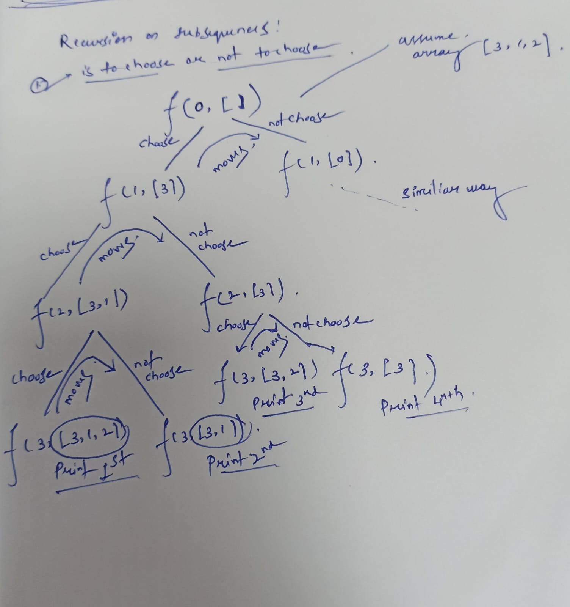

# DP Striver
In Normal Recursion problem we tend to calculate subproblems more than one time which is called **Overlapping Subproblems**, but this is just the waste of time , so we use **Memoization** method to make the tasks easier.

## Memoization
So we maintain an array which contains all the Values of Subproblems , so we can acess it later on.

Steps:
Declare a dp array dp[n+1] , n+1 is the maximum requirement of us.

Then store the answer/value of the subproblem or the vlaue that you are returning in an the same array **dp[n]**.

Then before calling the subproblems , first always check the condition, does f(n)!=-1 or not , if not then go ahead or otherwise return the value from the array.

## From Tabulation Method (Bottom Up)
Eliminating Recursion all together.

## Remember Always in DP if you are forming an array , form it as n+1

## How to guess its a DP problem
1. Count the total number of ways
2. Question might be There are certain ways , but try to find the minimum ways or the maximum ways of doing that

### Try all possible ways comes in (Count / Best way) --> Apply Recursion

## Shortcut Trick:
1. Try to represent the problem in terms of index. 
2. Do all possible stuffs on that problem statement , according to the problem statement.
3. sum of all stuffs --> count all stuffs.
4. Min of all stuffs --> find min.

### Recursion on Subsequences (Previous topic)
See code and the Recusive tree

Recursive tree and Diagram:

